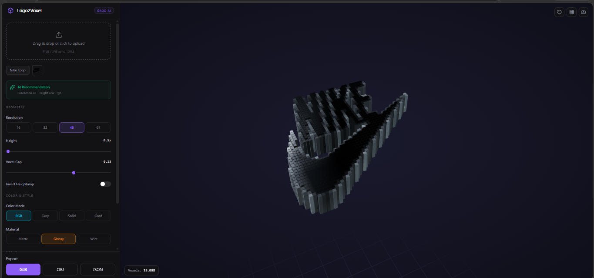

# 🧊 Logo2Voxel 3D — AI-Powered Logo Converter

> Transform flat 2D logos and custom text into interactive, highly-customizable 3D voxel models instantly in your browser.



---

## ✨ Key Features

- ⚡ **Instant 2D-to-3D Voxelization:** Converts PNG/JPG images and custom text into 3D voxel geometry in real-time.
- 🤖 **AI-Assisted Processing:** Integrated with **Groq AI** for intelligent color extraction and optimal geometry recommendations.
- 🎨 **Figma-Style Studio UI:** High-density, dark-mode control panel with live parameter tweaking.
- 🎛️ **Full Customization:**
  - **Geometry:** Adjustable Resolution (16px – 64px), Height Depth, Voxel Gap (Lego effect), and Invert Heightmap.
  - **Colors & Materials:** RGB Mode, Solid Color Picker, Height Gradients, Matte, Glossy, and Wireframe finishes.
  - **Lighting & Scene:** Studio, Sunset, and Neon lighting presets with realistic contact shadows.
- 📦 **3D Export Ready:** Export generated voxel models directly to `.GLB`, `.OBJ`, and `.JSON` for Blender/game engine usage.

---

## 🛠️ Tech Stack

### **Frontend**
- **Framework:** React + TypeScript + Vite
- **3D Engine:** Three.js / React Three Fiber (`@react-three/fiber`, `@react-three/drei`)
- **Styling:** Tailwind CSS + Lucide Icons

### **Backend**
- **Framework:** Python / FastAPI + Uvicorn
- **Image & Processing:** Pillow (PIL), NumPy, `rembg` (Background Removal)
- **AI Integration:** Groq SDK (Llama3 Vision / Color Analysis)

---

## 🚀 Quick Start (Local Development)

### Prerequisites
- Node.js (v18+)
- Python (v3.10+)

### 1. Backend Setup
```bash
cd backend
python -m venv venv
# On Windows:
.\venv\Scripts\activate
# On Mac/Linux:
source venv/bin/activate

pip install -r requirements.txt
uvicorn main:app --reload
```
> Backend server starts at `http://localhost:8000`.

### 2. Frontend Setup
```bash
cd frontend
npm install
npm run dev
```
> Frontend dev server starts at `http://localhost:5173`.

### 3. Open in Browser
Navigate to [http://localhost:5173](http://localhost:5173) and upload your logo or type custom text to start generating 3D voxel models.

---

## 📁 Project Structure

```
logo-voxel-3d/
├── backend/
│   ├── main.py              # FastAPI application entry point
│   ├── config.py            # Environment config (API keys, ports)
│   ├── routers/
│   │   └── convert.py       # API routes (convert, health, samples)
│   ├── services/
│   │   ├── voxel_generator.py    # Voxel grid generation logic
│   │   ├── image_processor.py    # Image validation & loading
│   │   ├── background_remover.py # Background removal (rembg)
│   │   └── groq_service.py       # Groq AI analysis
│   ├── samples/             # Sample logo images
│   └── requirements.txt
├── frontend/
│   ├── src/
│   │   ├── components/
│   │   │   ├── SidebarPanel.tsx   # Main control panel
│   │   │   ├── VoxelViewer.tsx    # 3D canvas & scene setup
│   │   │   ├── VoxelMesh.tsx      # Voxel geometry rendering
│   │   │   ├── ExportPanel.tsx    # GLB/OBJ/JSON export
│   │   │   └── ToastContainer.tsx # Toast notifications
│   │   ├── store/
│   │   │   └── voxelStore.ts      # Zustand global state
│   │   ├── utils/
│   │   │   ├── buildVoxelGeometry.ts  # Three.js geometry builder
│   │   │   ├── textToVoxel.ts         # Text to voxel conversion
│   │   │   ├── api.ts                 # HTTP client
│   │   │   ├── types.ts               # TypeScript types
│   │   │   └── toast.ts               # Toast system
│   │   └── index.css             # Tailwind CSS + custom styles
│   ├── package.json
│   └── vite.config.ts
└── README.md
```

---

## 🎮 Controls Overview

| Control | Description |
|---------|-------------|
| **Upload Zone** | Drag & drop or click to upload PNG/JPG logos |
| **Sample Gallery** | Pre-loaded sample logos for quick testing |
| **Resolution** | Voxel grid density (16–64px) |
| **Height** | Extrusion depth multiplier |
| **Voxel Gap** | Gap between voxels for a Lego-block effect |
| **Invert Heightmap** | Flip the height profile |
| **Color Mode** | RGB, Grayscale, Solid, or Gradient |
| **Material** | Matte, Glossy (with clearcoat), Wireframe |
| **Lighting** | Studio, Warm, Neon presets |
| **Text Voxel** | Type custom text, toggle Logo/Text/Both, offset position |
| **Auto-Rotate** | Turntable mode for recording/demo |
| **Export** | Download as GLB, OBJ, or JSON |

---

## 📦 API Reference

| Endpoint | Method | Description |
|----------|--------|-------------|
| `/api/convert` | `POST` | Upload image & return voxel grids for all resolutions |
| `/api/text-to-voxel` | `POST` | Generate voxels from rendered text image |
| `/api/samples` | `GET` | Fetch pre-loaded sample logos |
| `/api/health` | `GET` | Backend health check |

---

## 🧠 How It Works

1. **Upload / Type:** User uploads a logo image or types custom text.
2. **AI Analysis (optional):** Groq AI analyzes the image to recommend optimal resolution and settings.
3. **Background Removal:** `rembg` strips the background automatically.
4. **Voxelization:** The processed image is sampled at multiple resolutions and extruded into a flat 3D voxel grid (1–3 layers thick).
5. **Rendering:** Three.js builds merged BufferGeometry with vertex colors, flat shading, and per-voxel material properties.
6. **Customization:** All parameters (height, gap, color, material, lighting) update the scene in real-time via Zustand state.

---

## 🌐 Environment Variables

Create a `.env` file in the `backend/` directory:

```env
GROQ_API_KEY=gsk_your_key_here
PORT=8000
CORS_ORIGINS=["*"]
```

---

## 🤝 Contributing

Contributions are welcome! Feel free to open issues or submit pull requests for new features, bug fixes, or performance improvements.

---

## 📄 License

MIT License

---

## 🙏 Credits

- [Three.js](https://threejs.org/) — 3D graphics library
- [React Three Fiber](https://docs.pmnd.rs/react-three-fiber) — React renderer for Three.js
- [Drei](https://github.com/pmndrs/drei) — R3F utilities (OrbitControls, Environment, ContactShadows)
- [Groq](https://groq.com/) — AI inference for color analysis
- [rembg](https://github.com/danielgatis/rembg) — Background removal
- [FastAPI](https://fastapi.tiangolo.com/) — Python backend framework
- [Tailwind CSS](https://tailwindcss.com/) — Utility-first CSS
- [Lucide](https://lucide.dev/) — Open-source icons

---

*Built with passion for 3D design & AI experimentation.*
